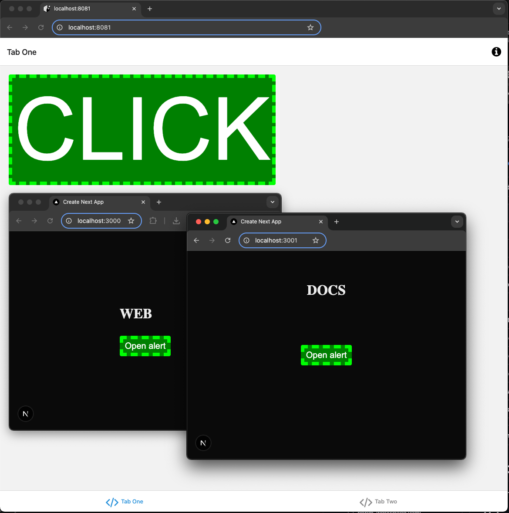

# Expo + React Strict Dom + Turborepo 
Working in progress trying to get [Expo](https://expo.dev/) and [Next](https://nextjs.org/) working with [React Strict Dom](https://github.com/facebook/react-strict-dom) inside [Turborepo](https://turbo.build/). Barely working as of now and still somewhat of a mess. Uses Expo's [tabs template](https://github.com/expo/expo/tree/main/templates/expo-template-tabs) inside a [Turbo](https://turbo.build/repo/docs) monorepo using their [basic template](https://github.com/vercel/turborepo/tree/main/examples/basic).

 
# Earlier Versions
- Basic version using Expo's [blank template](https://github.com/expo/expo/tree/main/templates/expo-template-blank) in in the [basic](https://github.com/stephenhandley/expo-rsd/tree/basic) branch.
- Version using Expo's [tabs template](https://github.com/expo/expo/tree/main/templates/expo-template-tabs) is in the [tabs](https://github.com/stephenhandley/expo-rsd/tree/tabs) branch.

# Repro
Originally was as repro for [this issue](https://github.com/facebook/react-strict-dom/issues/281) using the [setup process described here](./setup.md).

